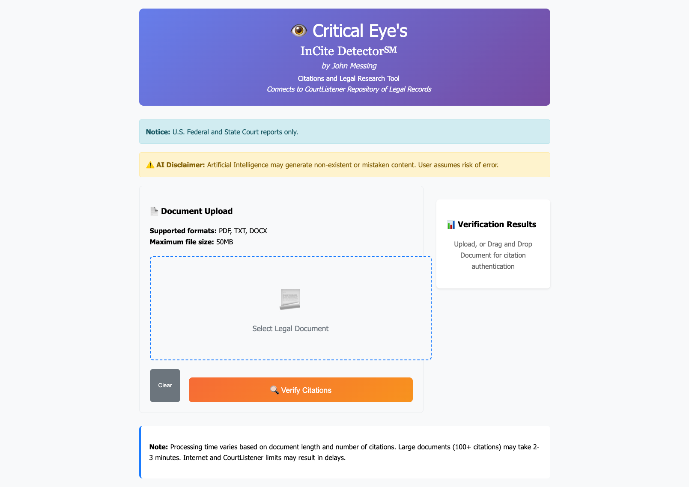
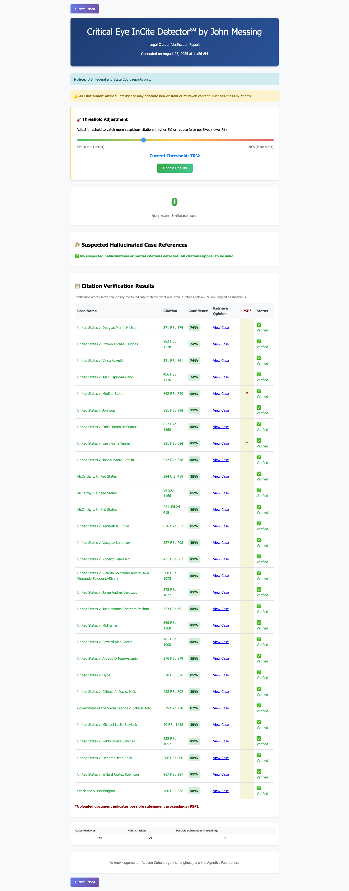
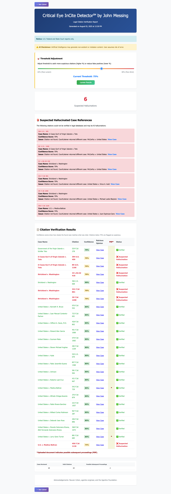
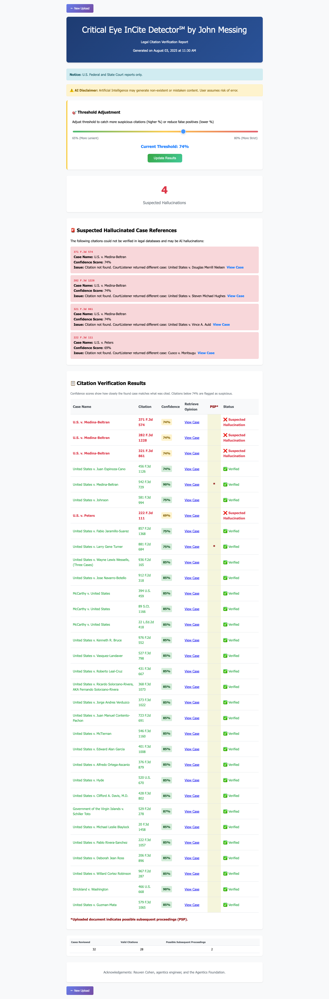
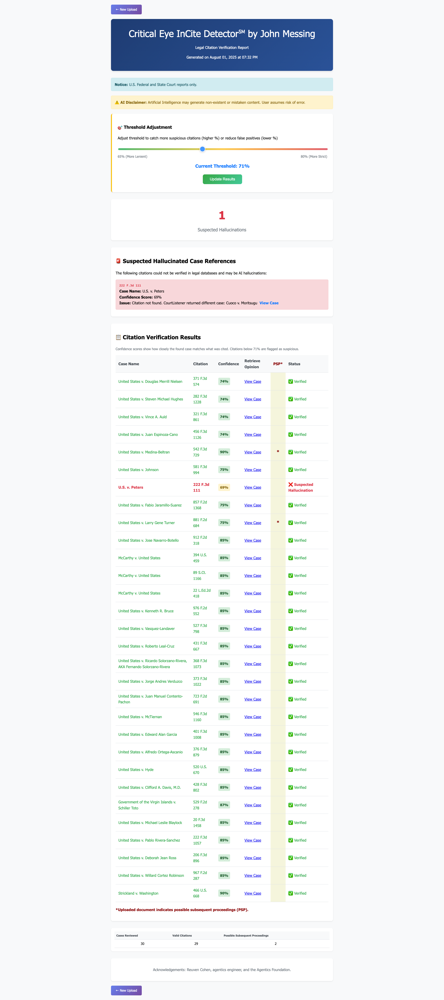
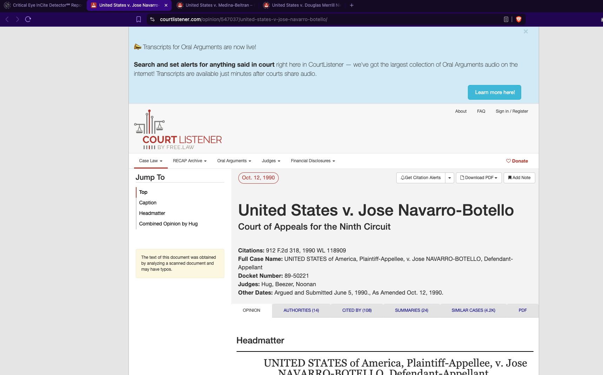
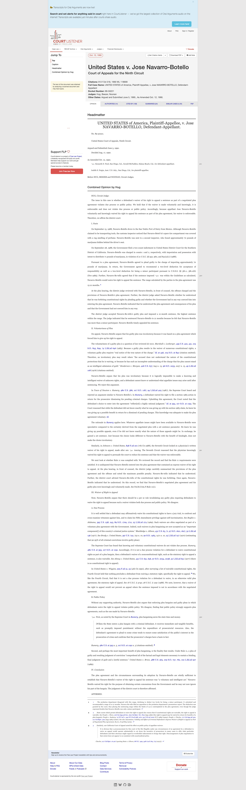
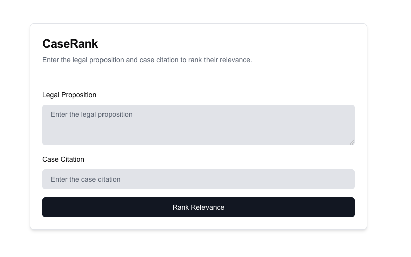

# Legal Document Citation Checker - Project Specifications

## Overview

This browser application screens legal documents prepared by others (which I will call LDO) for hallucinations, and then assesses the relevancy of legal authorities cited by them. It makes extensive use of a REST API of CourtListener (which I will call CL) which imposes usage limits and is located at https://www.courtlistener.com/help/api/rest/citation-lookup.(fn 1)*

An unfinished working prototype in Python was created as a precursor to this project. Unlike this mission, it uses a client-server architecture and both Python code and .json files which are included in the /prior-code directory. A sample LDO used in the prototype is included in .txt format in the /LDO directory. Various screenshots of the initial prototype are also provided inline as a guide to the vision and intent of the prototype. These appear in the /images folder. Extracts of planning dicusssions of unfinished portions are in the /discussions folder. Your mission is as follows: 
    A. Take the vision and unfinished prototype and redo it in Rust and deployed as WebAssembly (WASM) for universal browser compatibility. As the architecture and technology stack permit, keep the use of the CL Rest API to a minimum and cache responses for such operations as sensitivity adjustment, like the prototype. Eliminate the file upload requirement, if feasible and helpful.

Research and report back on various preferred ways to replace any parts that are functional in the prototype which do not work in the RUST and WASM technology stack,  build any parts that are still not yet started, not working properly, or are unfinished, and optimize the entire project for immediate use. Please use TDD London type testing until a fully working model is generated, ready for use. Do not let any test be labelled complete until all operations for that test have been successfully achieved.

## CourtListener API Limitations

(fn 1)* CL limits: "This API has four limitations on how much it can be used:

1. The performance of this API is affected by the number of citations it has to look up. Therefore, it is throttled to 60 valid citations per minute. If you are below this throttle, you will be able to send a request to the API. If a request pushes you beyond this throttle, further requests will be denied. When your request is denied, the API will respond with a 429 HTTP code and a JSON object. The JSON object will contain a wait_until key that uses an ISO-8601 datetime to indicate when you will be able to make your next request.

2. The API will look up at most 250 citations in any single request. Any citations past that point will be parsed, but not matched to the CourtListener database. The status key of such citations will be 429, indicating "Too many citations requested." See examples below for details.

3. Text lookup requests to this API can only contain 64,000 characters at a time. Requests with more than this amount will be blocked for security. This is about 50 pages of legal content.

4. To prevent denial of service attacks that do not contain any citations, this API has the same request throttle rates as the other CourtListener APIs. This way, even requests that do not contain citations can be throttled. (Most users will never encounter this throttle.)

A few other limitations to be aware of include: This API does not look up statutes, law journals, id, or supra citations. If you wish to match such citations, please use Eyecite directly. This API will not attempt to match citations without volume numbers or page numbers (e.g. 22 U.S. ___)."

## Process Flow

### 1. Document Upload
The user identifies an LDO for analysis in .pdf, .docx or .txt format via an appropriate selection method that formerly was via file upload to a server in the working prototype, as shown below.

*Webpage 1 upload page image from prototype*

### 2. Text Issues Fix Required
Add a copyright symbol to UX that will replace webpage1-upload. It should be located on the first visible browser page of the application that if the design is similar to webpage1-upload.png would be located just below the rent "Verify Citations" button of the prototype, centered, and in the format "© JHM 2025". 

### 3. Citation Extraction Enhancement
The working prototype currently extracts all cited cases from the LDO as a collection of pairs of case names and corresponding legal citations (which identify them specifically as court cases), and deduplicates the collection. The new Rust-WASM version you are building must do the same. One additional feature needs to be added, as the prototype does not yet identify any partial or deformed citations (e.g, that lack at least one case citation number). Please add the functionality to put such partial or deformed citations to the side in the extraction process, and send only the remainder to the Rest API of CL using the API key stored in the environmental folder of the prototype for verification (such partial or deformed citations, if sent to CL, can cause the CL session to terminate abruptly).

### 4. Table Preparation
The prototype currently prepares a table of all matched and hallucinated pairs with links to the actual cases as reported in the CL system. This functionality should be included in the Rust Wasm implementation.

*Webpage 2 image example from prototype without hallucinations*

### 5. Hallucination Detection
The prototype currently matches the strings extracted from the LDO (which may not be in proper legal Bluebook format or in the same format as they appear in CL (which uses fuzzy logic to make matches) and sent to CL against the strings that CL returns via the REST API (taking into account ths fuzzy logic of CL); isolates extracted case citations that do not have a match with any CL returned case citations and labels these as possible hallucinations. The Rust-WASM implememtation should, as an added feature add back to the list of possible hallucinations any deformed or partial citations that were identified but not sent to CL.

### 6. Sensitivity Slider
The prototype includes a slider for a user manually to change the sensitivity of the initial or selected confidence percentage level and obtain a new set of values by pressing a green Update Results button, which queries a cached copy of the CL results (avoiding repeated calls to the CL REST interface). This should be mimicked in the Rust-WASM version. The user thus can increase or decrease the sensitivity level in order to verify that there are no missed hallucinations in the event that the default sensitivity setting was initially too low for the uploaded LDO or to remove false positives because the level was initially set too high.

### 7. Default Sensitivity Investigation Required
Currently the prototype uses a default baseline sensitivity level of 70, but the ideal setting may vary between different LDO's, according to limited testing, which needs to be investigated and implemented if possible,  and appropriate instructions and explanation provided to a user. Please research, report back and upon approval, implement any such improvements.

### 8. False Positive Detection
A user can check the ideal sensitivity level of the prototype for this particular LDO by increasing the sensitivity setting until false positives of hallucinations begin to appear in the formatted output.

### 9. False Positive Verification
The false positives can be determined to be such because each cites at least one valid case variant that can be authoritatively verified by clicking the View Case link next to it, which opens a new browser tab that contains the CL webpage and displays the actual citation and text of the authentic case in its system. The view case link or button opening a new web browser tab to display the actual case in the CL database must be preserved.

### 10. False Positive Display Variations
Where a suspected hallucination is reported and the sensitivity of the page is increased, false positives appear differently than when zero hallucinations alone are first reported. See displayed example images, below.

*Webpage 2A example from prototype without hallucinations but with false positives*

### 11. False Positive Verification Method
The fact that such page contains false positives can be verified by checking that the false positives and at least one verified variant share the same case name, in the example, United States v. Medina. When the verified result is opened using a View Case link, the result confirms that the authentic opinion and proper citation in the CL system. Where the sensitivity guage of a returned report page that contains a suspected hallucination is increased, false positives also appear when the setting is sufficiently increased, but they may present differently. 

*Webpage 2B example from prototype with suspected hallucination and false positives*

### 12. False Positive Display Requirement
All such false positive citations should all be displayed to the user only as "suspected false positives" in the table of returned results in an orange color, rather than the different confusing ways they now are presented. Ideally, in the process of detecting hallucinations, the proper setting that allows only suspected hallucinations without false positives to be displayed should be pre-determined and used.

### 13. Prototype Development Status
The prototype as developed was not able actually to achieve this result though some chatbot sessions discussed how to build it, the high points of which are also included in Discussions 1 in the discussions sub-folder.

### 14. Partial Citation Display
What the prototype does not yet allow and you should also add is a way also to include in the outputted table of possible hallucinations any partial or deformed citations that were never sent to CL and therefore have no link to show or test the result in the CL database of court opinions, but should nevertheless be displayed to the user. Possible options to explore include identifying such partial or malformed citations by searching for any "v" or "v." or "vs" or "vs." in the name of the case, such as Jones v. Smith, or uses another phrase such as "In re" or "In the Matter of" or any other way a state or federal US law case is named and that exists in practice. If such structure exists in the title but one or more of the numbers do not appear in the citation identification (e.g. 131 US 33) or no citation exists at all, then the partial or deformed citation should nonetheless appear in the results of possible hallucinations, so that a user can search for it in the LDO and investigate further. Therefore, erring on the side of being overly-inclusive is preferable to being under-inclusive.

### 15. Hallucination Detection Accuracy
If an LDO containing a fabricated citation is uploaded with the correct sensitivity setting, the prototype reveals the suspected hallucination. This behavior must be adopted by the Rust-WASM version you are building.

*Webpage 3 image example from prototype showing suspected hallucination without false positives*

### 16. Mathematical Error Correction
For unknown reasons the total number of cases reviewed and valid citations between the non-hallucinated (webpage 2) and hallucinated results (webpage 3) do not add up mathematically in the prototype. Only one additional hallucinated citation is included in the LDO, but the prototype incorrectly adds one more. Please correct any and all such mathematical errors.

### 17. Case Link Functionality
Each link to view a case currently opens as a new browser tab containing the actual text of the case in the CL system, and thus naturally constitutes a useful workspace of many multiple browser tabs to enable a user conveniently to view the opened case texts in isolation or collectively as the user wishes.

*Image 4. From a Grouping of CL Court Opinions, each opened as a new browser window, a single tab showing what viewer initially sees without scrolling down*

*Image 4a. Single CL Court Opinion in a new browser window, showing entire page that can be seen, with scrolling*

### 18. Additional Case Analysis Functionality Required
Each tab that displays a case in CL, requires additional functionality and you should add it for the following: a first button should allow the user to Check Relevancy. When pressed, the first button should disappear and a superimposed dashboard somewhere in the browser tab should appear, to enable the user to enter text from the LDO (or any other source) and, upon pressing a submit button, obtain a relevancy score of a proposition entered by the user in the textbox to the displayed case in the browser tab itself. A second readonly textbox should also explain to the user the reasoning behind the assigned relevancy score. A clear button should clear the initially entered and returned text and allow for another proposition to be entered and its relevancy scored, along with the explanation of the new relevancy score. Still another button should allow the user to distill or extract the precise decision of the case itself as concisely as possible, without its relevancy to anything in the LDO. This functionality should extend to any browser tab that displays a CL returned case, but not other browser tabs that a user may open for other purposes. The prototype never achieved this functionality but a separate piece that was constructed using .json did, as discussed below. The functionality was achieved with a query to an LLM, which returned a relevancy score with explanation of how it was calculated. In the Rust-WASM system, such functionality should be achieved using the best architecture for this kind of analysis, and if it requires LLM usage, then Claude should enable it using its Claude Code or the Anthropic API. Please research out the architecture, provide a recommendation with reasons, and wait for approval before tasking.

### 19. CaseRank Integration Note
The Case Citation feature of CaseRank is unnecessary in this architecture since the CL court opinion is already displayed in the browser with its citation plainly visible.

*Image 5 - CaseRank separately developed prototype*

### 20. Additional Legal Authority Sources
CL only includes court cases. Sometimes analysis of LDO's, including hallucinations will also require retrieving cited or quoted statutes, administrative rules and regulations or Court Rules to determine if any of the citations are hallucinated. Such statutes, administrative rules and regulations or Court Rules will need to be retrieved separately from various online repositories for retrieval and review, in a manner similar to the cases from CL. Such repositories for various states of the United States are usually organized by State. Repositories of federal statutes and administrative rules are usually found in collections from Universities, like Cornell University's LLW collection. Please conduct a review of such repositories and recommend how to architect adding statutes, administrative rules and regulations and Court Rules to the project, then wait for approval before proceeding to task or build them.

### 21. Data Storage
All relevant data about the LDO is currently saved as json data files in the saved_results folder of the prototype and the LDO's themselves are saved in the uploads folder of the prototype. Please determine whether this method should be preserved in the Rust-WASM implmentation, or a better option exists. If so please describe it and wait for approval before constructing.

### 22. Legal Disclaimer Addition
In displayed text of the reporting page, immediately beneath the text "Acknowledgements: Reuven Cohen, agentics engineer, and the Agentics Foundation." add a blank line and then the following text in all caps: THE SOFTWARE IS PROVIDED "AS IS", WITHOUT WARRANTY OF ANY KIND, EXPRESS OR IMPLIED, INCLUDING BUT NOT LIMITED TO THE WARRANTIES OF MERCHANTABILITY, FITNESS FOR A PARTICULAR PURPOSE AND NONINFRINGEMENT. IN NO EVENT SHALL THE AUTHORS OR COPYRIGHT HOLDERS BE LIABLE FOR ANY CLAIM, DAMAGES OR OTHER LIABILITY, WHETHER IN AN ACTION OF CONTRACT, TORT OR OTHERWISE, ARISING FROM, OUT OF OR IN CONNECTION WITH THE SOFTWARE OR THE USE OR OTHER DEALINGS IN THE SOFTWARE.

## Screenshots Referenced

The document references several webpage screenshots from the prototype, which are provided as a way to convey the vision behind this project as embodied in the prototype and thus as a guide, but not as a prescription to follow in Rust-Wasm, which may require a different archtecture altogether:
- Webpage 1: Upload page image from prototype
- Webpage 2: Example from prototype without hallucinations
- Webpage 2A: Example from prototype with hallucination and false positives
- Webpage 2B: Example from prototype without hallucinations but with false positives
- Webpage 3: Example from prototype showing suspected hallucination without false positives
- Image 4: From a Grouping of CL Court Opinions, each opened as a new browser window
- Image 4a: Single CL Court Opinion in a new browser window, showing entire page with scrolling
- Image 5: CaseRank separately developed prototype

## Development Notes

- Use TDD London type testing throughout development
- Ensure all tests pass completely before marking any feature as complete
- Prototype includes Python code, sample LDO files, and various screenshots as guides, located in the reviously described subfolders.
- API key for CourtListener is stored in /environmental subfolder